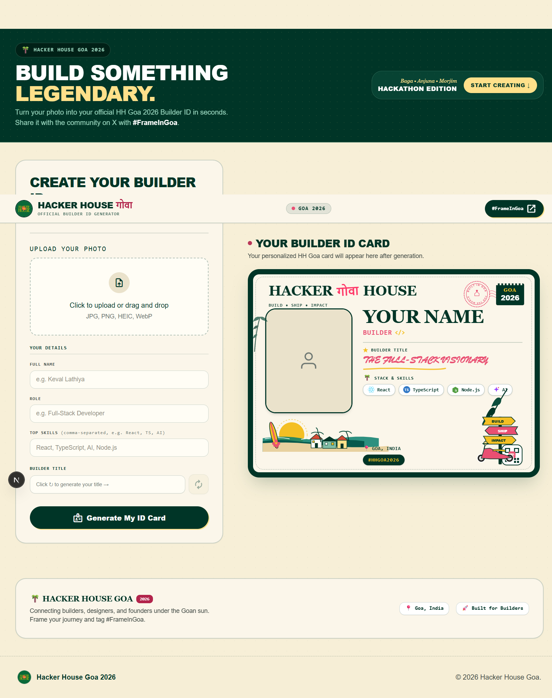

# HH Goa 2026 Builder ID Card Generator

A mobile-first web application to generate branded HH Goa 2026 Builder ID cards from photos and identity details, with title generation powered by Gemini AI and instant social sharing to X (`#FrameInGoa`).

<p align="center">
  
</p>

## Features

- **No-login flow**: Fast photo and details input without sign-up.
- **Smart Image Handling**: Accepts JPG, PNG, and HEIC formats.
- **AI Title Generation**: Generates concise builder titles using `@google/generative-ai`.
- **Card Rendering & Export**: Renders card using HTML/CSS and exports to PNG/JPEG via `html-to-image`.
- **Social Preview**: Uploads generated card to Vercel Blob with dynamic Open Graph (`/card/[id]`) previews for X sharing.

## Tech Stack

- **Framework**: [Next.js](file:///d:/HH_GOA/package.json) (App Router, React 19)
- **Styling**: Tailwind CSS v4
- **AI Integration**: `@google/generative-ai`
- **Storage**: `@vercel/blob`
- **Validation & Forms**: React Hook Form, Zod

## Getting Started

### Prerequisites

- Node.js 18+
- npm / pnpm / yarn

### Environment Variables

Create a `.env.local` file based on `.env.example`:

```bash
GEMINI_API_KEY=your_gemini_api_key
BLOB_READ_WRITE_TOKEN=your_vercel_blob_token
NEXT_PUBLIC_APP_URL=http://localhost:3000
```

### Installation

```bash
npm install
```

### Development Server

Run the development server:

```bash
npm run dev
```

Open [http://localhost:3000](http://localhost:3000) in your browser.

## Scripts

- `npm run dev` - Starts the Next.js development server.
- `npm run build` - Builds the application for production.
- `npm run start` - Starts the production server.
- `npm run lint` - Runs ESLint.

## Project Structure

```text
app/
├── api/            # API routes (Gemini builder-title, Blob upload)
├── card/[id]/      # Public card preview & dynamic OpenGraph route
├── layout.tsx      # Root layout
└── page.tsx        # Main generator interface
components/         # UI & Generator components
lib/                # Shared utilities (gemini, blob, share, image)
docs/               # PRD, Architecture, and design docs
```
